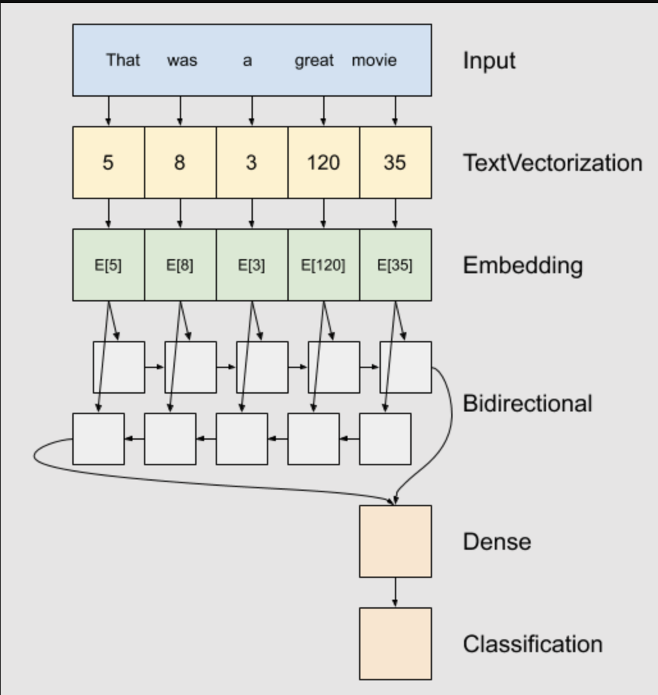
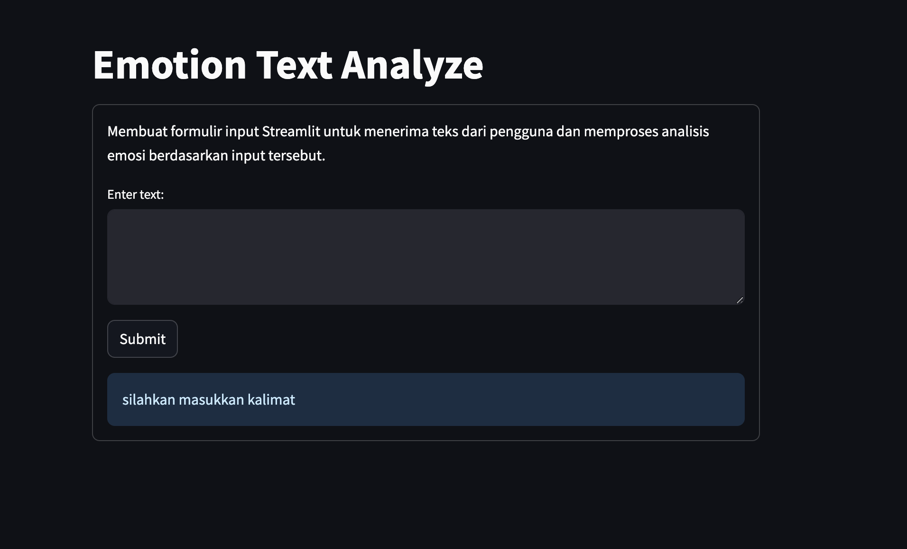
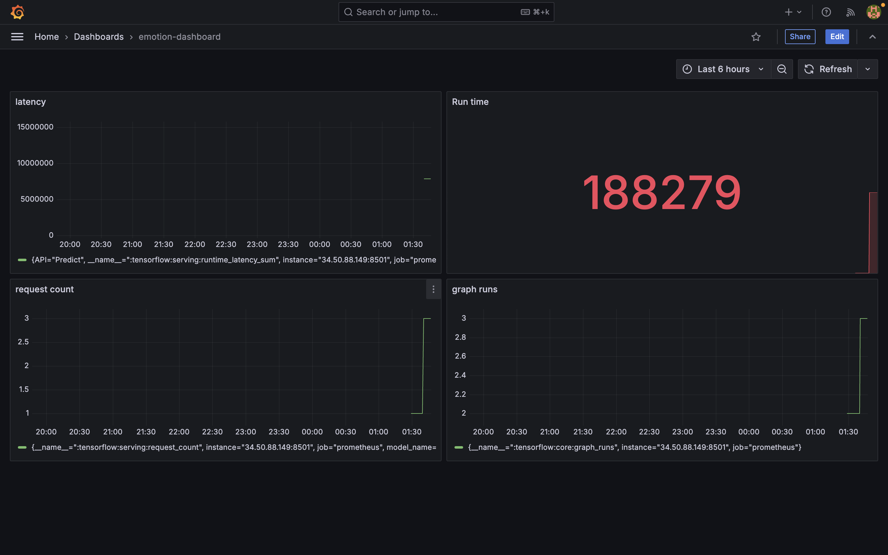

# emotion-classification-with-tfx

Pada proyek kali ini akan menyelesaikan permasalahan klasifikasi emotion secara end-to-end pipeline menggunakan tfx

## Dataset

Dataset yang digunakan merupakan dataset public yang di dapatkan dari kaggle,
[Dataset](https://www.kaggle.com/datasets/nelgiriyewithana/emotions) ini merupakan kumpulan pesan dari twitter  dianotasi dengan enam emosi dasar: (0) sadness, (1) joy, (2) love, (3) anger, (4) fear, (5) surprise, dengan jumlah dataset 416809

## Problem
Dataset ini berfungsi sebagai sumber daya yang berfungsi mengklasifikasikan beragam spektrum emosi yang diekspresikan dalam teks singkat di media sosial.

## Preprocesing data

Dalam menyiapkan data untuk masuk ke model melewati beberapa process untuk membuat dataset tersebut siap untuk di train.

1. stemming text
Teknik stemming membantu dalam mereduksi kata-kata ke bentuk dasarnya, sehingga variasi kata yang serupa dapat dianggap sama, yang mengurangi kompleksitas dan dimensi fitur. 

2. case folding
Case Folding merupakan proses untuk mengkonversi teks ke dalam format huruf kecil (lowercase). Hal ini bertujuan untuk memberikan bentuk standar pada teks.

3. stop words
Stop words membantu mengurangi noise dan fokus pada kata-kata kunci yang lebih informatif dalam teks.

4. vektor
Teks tersebut kemudian diubah menjadi vektor numerik menggunakan metode Word Embeddings. Ini berguna karena model machine learning biasanya memerlukan input dalam bentuk numerik, dan representasi vektor ini membantu dalam menangkap makna dan hubungan antar kata dalam teks, yang diperlukan oleh model untuk melakukan klasifikasi emosi dengan akurat.

Dengan menggunakan teknik preprocesing yang tepat dapat membantu kinerja model dalam menyelesaikan permasalahan yang ingin di selesaikan.

## Model

Solusi yang dapat digunakan untuk menyelesaikan permasalahan ini adalah dengan menggunakan pendekatan RNN (Recurrent Neural Network). RNN adalah jenis arsitektur jaringan saraf yang sangat cocok untuk memproses urutan data, seperti teks. Dengan memanfaatkan kemampuan RNN untuk memahami konteks urutan data, kita dapat menggunakannya untuk menganalisis dan mengklasifikasikan emosi dalam pesan-pesan Twitter.




## metriks evaluasi

Dalam mengukur kinerja model menggunakan beberapa metrik evaluasi seperti accuracy, precission, recall, f1-score dan confusion matrix. Metrik-metrik ini membantu untuk mengevaluasi seberapa baik model dalam menyelesaikan masalah klasifikasi atau regresi yang dihadapi.

## Performa model

Model ini memperoleh hasil yang cukup baik, dengan

accuracy:79% 

precision:90%

recall:72% 

f1-score:80%

Hasil ini menunjukkan bahwa model memiliki kinerja yang lumayan baik dalam mengklasifikasikan data uji.

## API Reference

Deployment menggunakan GCP

#### Predict

```http
  http://<external_ip>:8501/v1/models/1709760128:predict
```

#### Prometheus

```http
  http://<external_ip>:9090
```

#### Grafana

```http
  http://<external_ip>:3000 
```

## Demo dan Tautan web


Untuk melakukan demo secara local silahkan install docker terlebih dahulu dan jalankan perintah yang dibawah ini
```bash
  docker build -t <name_user>/emotion-classification .
  docker run -p 8501:8501 acqmal/web-app-emotion
```
Note: Posisi directory lagi didalam folder app

atau bisa menggunakan link dibawah ini

Link web:<a href="https://emotion-classification-tfx.streamlit.app/">link</a>

## Monitoring
Dashboard Grafana ini memantau kinerja TensorFlow Serving dengan panel berikut:

1. Latency: Menunjukkan waktu tunda (latency) proses prediksi model.
2. Run Time: Menampilkan total waktu eksekusi semua permintaan (nilai: 188279).
3. Request Count: Mengukur jumlah permintaan prediksi yang diterima model.
4. Graph Runs: Memantau jumlah operasi TensorFlow yang dijalankan.

Dashboard digunakan untuk memantau performa, mendeteksi masalah, dan menganalisis beban kerja model.

by acqmal fadhilla latief

